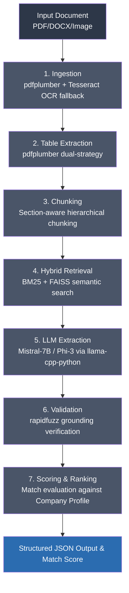

<h1 align="center">
  <span style="color: #2b6cb0">Tender</span><span style="color: #2d3748">ExtractPro</span>
</h1>

<p align="center">
  
  
  
  
</p>

A production-grade RAG pipeline for extracting technical specifications and scope of work from tender documents. Processes real PDF, DOCX, and image files through a 6-stage pipeline: ingestion, table extraction, chunking, hybrid retrieval, LLM extraction, and grounding validation. 

<span style="color: #e53e3e; font-weight: bold;">NEW:</span> Includes an LLM-powered <strong>Scoring and Ranking</strong> mechanism to evaluate the extracted tender against a customized Company Profile to determine match score and cost feasibility.

## Architecture



## Quick Start

### 1. Setup Backend
```bash
# Setup environment
python -m venv venv
venv\Scripts\activate
pip install -r requirements.txt

# Run the API server
uvicorn api.main:app --host 127.0.0.1 --port 8000 --reload
```

### 2. Setup Frontend
```bash
cd frontend
npm install
npm run dev
```

See [SETUP.md](SETUP.md) for detailed installation instructions including Tesseract, Poppler, and model download.

## Features

### Extracted Tender Elements
The pipeline produces a JSON file containing:
- **Technical Specifications**: Components, specs, and constraints.
- **Scope of Work**: Summaries, deliverables, exclusions, and locations.
- Every extracted value includes a source citation pointing back to the exact chunk and page in the original document.

### Match Scoring & Ranking
You can define a **Company Profile** (via the UI or `company_profile.json`) specifying capabilities, budget constraints, and operational exclusions. The pipeline evaluates the tender's requirements against this profile to output:
- **Match Score (0-100)**: Quantitative alignment score.
- **Cost Feasibility (High/Medium/Low)**: Budget match based on the company's financial capabilities.
- **Strategic Reasoning**: Paragraph outlining the reasoning and any potential red flags.

### Anti-Hallucination Safeguards
1. **Prompt Engineering**: The LLM prompt explicitly instructs "use NOT_FOUND for missing fields, NEVER invent values" and requires source citations.
2. **Grounding Verification**: After LLM extraction, every spec is fuzzy-matched against source chunks using `rapidfuzz`. Specs with grounding score below 0.40 are rejected.
3. **Pydantic Validation**: Output is validated against strict Pydantic v2 models.

## Project Structure

```
TenderExtractPro/
  api/
    main.py             -- FastAPI server with extraction and scoring endpoints
  frontend/             -- React + Vite User Interface
  tender_extraction/
    config.py           -- Centralized configuration
    schemas.py          -- Pydantic v2 models for structured output
    scoring.py          -- LLM matching logic for company profile
    extraction.py       -- LLM-powered specification extraction
    main.py             -- Pipeline orchestration and CLI
  company_profile.json  -- Active company profile configurations
  dataset/              -- Real tender PDF files for testing
  models/               -- LLM model files (not in version control)
```

## Configuration

All tunable parameters are centralized in `tender_extraction/config.py`. Key settings:

| Parameter | Default | Description |
|---|---|---|
| `chunking.max_chunk_tokens` | 400 | Maximum tokens per text chunk |
| `retrieval.bm25_weight` | 0.4 | BM25 weight in score fusion |
| `retrieval.embedding_weight` | 0.6 | Embedding weight in score fusion |
| `llm.temperature` | 0.1 | LLM generation temperature |
| `validation.min_grounding_ratio` | 0.40 | Minimum grounding score to accept a spec |

## License

MIT
